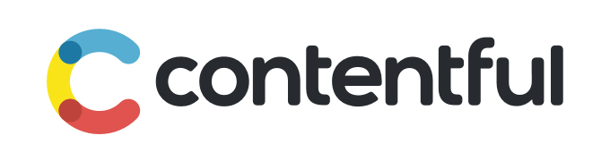

<a href="https://www.contentful.com" target="_blank"></a>

# contentful.swift

[](https://cocoapods.org/pods/Contentful)
[](https://github.com/Carthage/Carthage)
[](https://swift.org/package-manager/)

[](https://travis-ci.org/contentful/contentful.swift)
[](https://coveralls.io/github/contentful/contentful.swift)
[](https://codebeat.co/projects/github-com-contentful-contentful-swift)

Swift SDK for the [Contentful][1] Content Delivery API.

[Contentful][1] provides a content infrastructure for digital teams to power content in websites, apps, and devices. Unlike a CMS, Contentful was built to integrate with the modern software stack. It offers a central hub for structured content, powerful management and delivery APIs, and a customizable web app that enable developers and content creators to ship digital products faster.


However, it provides a more usable API than the [Objective-C SDK][4] and has support for more API features. It is recommended to use contentful.swift over contentful.objc as future development at Contentful will focus on Swift rather than Objective-C. However, if your project must utilize Contentful's [Content Managamement API][11], Objective-C is the only  language supported at the moment. See [ContentfulManagementAPI at Cocoapods.org][12] for more information.

#### Full feature comparison of [contentful.swift][10] & [contentful.objc][4]

| CDA Features | [contentful.swift][10] | [contentful.objc][4] |
| -----------  | ----------- | ----------- |
| API coverage* | :white_check_mark: | :white_check_mark: |
| Images API | :white_check_mark: | :white_check_mark: |
| Search Parameters | :white_check_mark: | :no_entry_sign: |
| Fallback locales for sync api | :white_check_mark: | :no_entry_sign: |
| Rate limit handling | :white_check_mark: | :no_entry_sign: |

*API Coverage definition: all endpoints can be interfaced with and complex queries can be constructed by passing in dictionaries of http parameter/argument pairs. Note that the Swift SDK provides much more comprehensive coverage and takes advantage of type system, outdoing the "stringly typed" interface that the Objective-C SDK offers.

## Usage

First, grab credentials for your Contentful space by [navigating to the "APIs" section of the Contentful Web App](https://app.contentful.com/deeplink?link=api).
If you don't have access tokens for your app, create a new set for the Delivery and Preview APIs.
Next, pass the id of your space and delivery access token into the initializer like so:

```swift
let client = Client(spaceId: "cfexampleapi",
                    accessToken: "b4c0n73n7fu1")
```

To access the Content Preview API, use your preview access token and set your client configuration to use preview as shown below.

```swift
var clientConfiguration = ClientConfiguration()
clientConfiguration.previewMode = true

let client = Client(spaceId: "cfexampleapi",
                    accessToken: "e5e8d4c5c122cf28fc1af3ff77d28bef78a3952957f15067bbc29f2f0dde0b50",
                    clientConfiguration: clientConfiguration)
```

The `client` should be configured. Let's use it to fetch an entry.

```swift
client.fetchEntry(id: "nyancat") { (result: Result<Entry>) in
    switch result {
        case .success(entry):
            print(entry)
        case .error(let error):
            print("Error \(error)!")
    }
}
```

## `EntryDecodable`

The `EntryDecodable` protocol allows you to define types that will be mapped from `Entry`s of the various content types in your Contentful space. When using methods such as:

```swift
let query = QueryOn<Cat>.where(field: .color, .equals("gray"))

func fetchMappedEntries(matching: query) { (result: Result<MappedArrayResponse<Cat>>) in
    guard let cats = result.value?.items else { return }
    print(cats)
}
```

The asynchronously returned result will be an instance of `MappedArrayResponse` in which the generic type parameter is the class you've defined for your content type. If you are using a `Query` that does not restrict the response to contain entries of one content type, you will use methods that return `MixedMappedArrayResponse` instead of `MappedArrayResponse`. The `EntryDecodable` protocol extends the `Decodable` protocol in Swift 4's Foundation standard library. The SDK provides helper methods for resolving relationships between `EntryDecodable`s and also for grabbing values from the fields container in the JSON for each resource.

In the example above, `Cat` is a type of our own definition conforming to `EntryDecodable` and `ResourceQueryable`. The source for this model class is below; note the helper methods the SDK adds to Swift 4's `Decoder` type to simplify for parsing JSON returned by Contentful.

```swift
final class Cat: EntryDecodable, ResourceQueryable {

    static let contentTypeId: String = "cat"

    let sys: Sys
    let color: String?
    let name: String?
    let lives: Int?
    let likes: [String]?

    // Relationship fields.
    var bestFriend: Cat?

    public required init(from decoder: Decoder) throws {
        sys             = try decoder.sys()
        let fields      = try decoder.contentfulFieldsContainer(keyedBy: Cat.Fields.self)

        self.name       = try fields.decodeIfPresent(String.self, forKey: .name)
        self.color      = try fields.decodeIfPresent(String.self, forKey: .color)
        self.likes      = try fields.decodeIfPresent(Array<String>.self, forKey: .likes)
        self.lives      = try fields.decodeIfPresent(Int.self, forKey: .lives)

        try fields.resolveLink(forKey: .bestFriend, decoder: decoder) { [weak self] linkedCat in
            self?.bestFriend = linkedCat as? Cat
        }
    }

    enum Fields: String, CodingKey {
        case bestFriend
        case name, color, likes, lives
    }
}
```

## Swift playground

If you'd like to try an interactive demo of the API via a Swift Playground, do the following:

```bash
git clone --recursive https://github.com/contentful/contentful.swift.git
cd contentful.swift
make open
```

Then build the "Contentful_macOS" scheme, open the playground file and go! Note: make sure the "Render Documentation" button is switched on in the Utilities menu on the right of Xcode, and also open up the console to see the outputs of the calls to `print`.

## Reference Documentation

For further information about the API, check out the [Content Delivery API Reference Documentation][3].

## Swift Versioning

It is recommended to use Swift 4, as older versions of the SDK will not have fixes backported. If you must use older Swift versions, see the compatible tags below.

 Swift version | Compatible Contentful tag |
| --- | --- |
| Swift 4.0 | [ > `0.10.0`] |
| Swift 3.x | [`0.3.0` - `0.9.3`] |
| Swift 2.3 | `0.2.3` |
| Swift 2.2 | `0.2.1` |

### CocoaPods installation

[CocoaPods][2] is a dependency manager for Swift, which automates and simplifies the process of using 3rd-party libraries like the Contentful Delivery API in your projects.

```ruby
platform :ios, '8.0'
use_frameworks!
pod 'Contentful'
```

You can specify a specific version of Contentful depending on your needs. To learn more about operators for dependency versioning within a Podfile, see the [CocoaPods doc on the Podfile][7].

```ruby
pod 'Contentful', '~> 1.0.1' 
```

Note that for Swift 3 support (contentful.swift versions [`0.3.0` - `0.9.3`]) you will need to add a post-install script to your Podfile if installing with Cocoapods:

```ruby
post_install do |installer|
  installer.pods_project.targets.each do |target|
    target.build_configurations.each do |config|
      config.build_settings['SWIFT_VERSION'] = '3.2'
    end
  end
end
```

### Carthage installation

You can also use [Carthage][8] for integration by adding the following to your `Cartfile`:

```
github "contentful/contentful.swift" ~> 1.0.1
```

## License

Copyright (c) 2016 Contentful GmbH. See LICENSE for further details.

[1]: https://www.contentful.com
[2]: http://www.cocoapods.org
[3]: https://www.contentful.com/developers/documentation/content-delivery-api/
[4]: https://github.com/contentful/contentful.objc
[5]: https://www.contentful.com/blog/2014/05/09/ios-content-synchronization/
[6]: https://github.com/contentful-labs/swiftful
[7]: https://guides.cocoapods.org/using/the-podfile.html
[8]: https://github.com/Carthage/Carthage
[10]: https://github.com/contentful/contentful.swift
[11]: https://www.contentful.com/developers/docs/references/content-management-api/
[12]: https://cocoapods.org/pods/ContentfulManagementAPI
